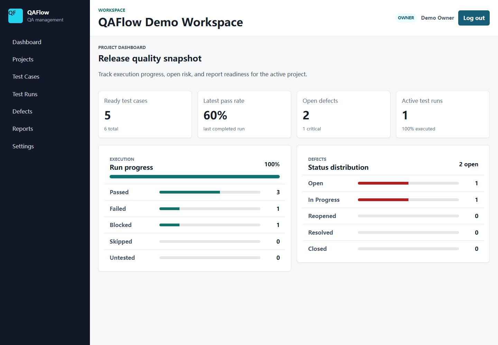
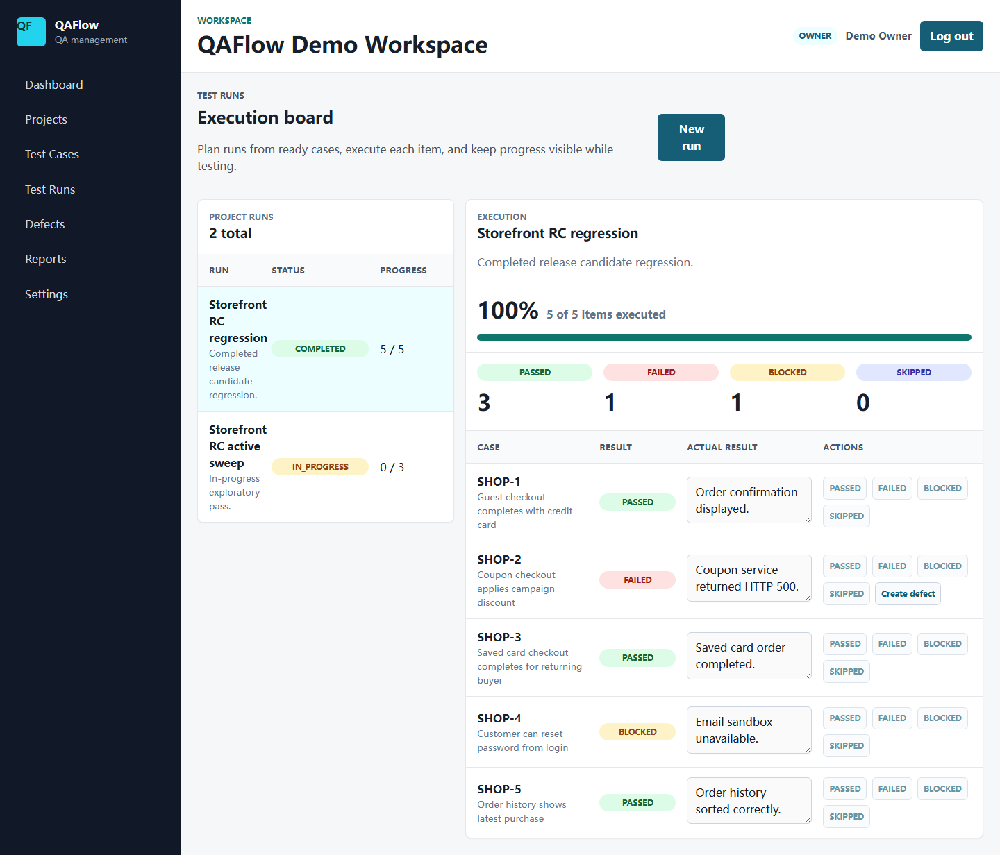
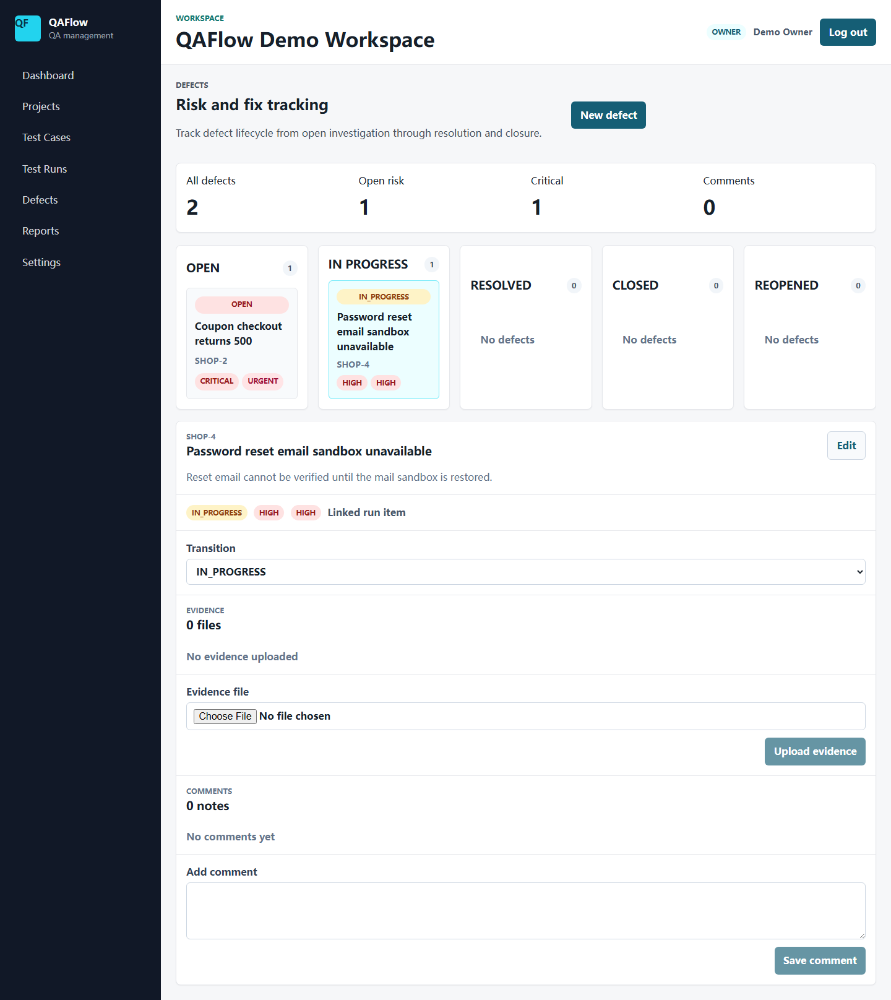
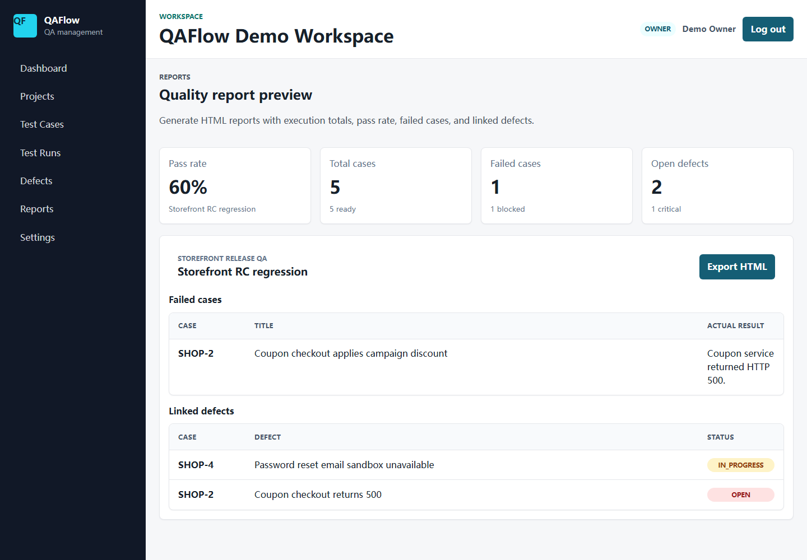

# Screenshots

These screenshots were captured from the Docker demo stack with the seeded `dev,demo` profile.

Run the stack and refresh the images with:

```powershell
docker compose up --build -d
cd apps/web
pnpm screenshots:demo
```

## Dashboard



## Test Runs



## Defects



## Reports


